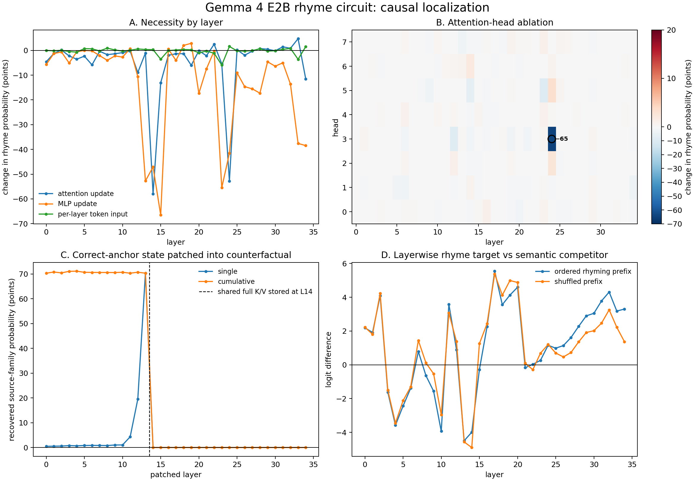

# How Gemma 4 E2B chooses a rhyming word

> **Post-publication note (phase 2).** After this report was written we found
> that the pinned Transformers revision ignores the attention mask on Gemma
> 4's sdpa path, mildly contaminating left-padded batch rows. Every experiment
> was re-run with eager attention: all headline numbers replicate within noise
> (for example clean rhyme mass 78.6% vs 78.8%; L24H3 ablation to 13.4% vs
> 13.7%; value transfer 108.8% vs 108.9%). Details and the corrected table are
> in `03_gemma4_rhyme_representation.md`, which also answers this report's open
> questions on scheme routing and representation content.

## Executive conclusion

The evidence supports a compact, causal account of rhyme completion in Gemma 4
E2B under our fixed `AABBCC` demonstration prompt:

1. **The relevant line-ending word is encoded by the middle of the model.** The
   residual state entering layer 14 determines which rhyme family will be used.
2. **Layer 14 writes the anchor's content into a shared full-attention value
   memory.** Later full-attention layers reuse this memory rather than recomputing
   keys and values.
3. **Layer 24, head 3 retrieves the line-ending position.** Its final-token query
   puts 91.2% of its attention on the rhyme anchor on average.
4. **That head carries the rhyme constraint into the final token.** Removing it
   drops mean exact-rhyme probability from 78.8% to 13.7% and greedy rhyme
   accuracy from 92% to 24%.
5. **Nearby MLPs turn the retrieved constraint into a lexical choice.** The most
   important dense updates occur at layers 15 and 23, immediately after memory
   construction and immediately before L24H3 retrieval.

The strongest intervention is a direct memory transfer. On five prompts where
only the earlier anchor word changes, replacing the layer-14 **value** at that
anchor position transfers 109% of the source rhyme preference. Replacing the key
transfers 0%. Transferring only L24H3's output recovers 110% of the source
candidate preference.

This is a candidate circuit, not a claim that the rest of the model is
irrelevant. Semantics still determines which member of the permitted rhyme family
is appropriate, and several MLPs make large contributions.



## What was analyzed

The subject is the base model `google/gemma-4-E2B`, not its instruction-tuned
variant. Most experiments use bitsandbytes NF4 4-bit weights on an RTX 4080. A
central five-example head-ablation result was repeated in BF16.

Every target receives the same six-line prefix:

```text
The rain made mirrors in the lane
At dusk there came a distant train
The fire faded to a glow
Beyond the glass descended snow
A gull went wheeling by the sea
It spread its wings and wandered free
```

This is followed by one of 25 incomplete couplets, for example:

```text
The roof began to drum with rain
Beyond the fields there passed a
```

Gemma's greedy next word is `train`. Across the 25 targets, 23 greedy words
rhyme. The unit of analysis is always the target poem (`n=25`), not the 100 rows
created by presenting each poem under four conditions.

An **anchor** is the word at the end of the completed target line (`rain`). A
**rhyme family** contains single-token CMUdict words matching from the final
stressed vowel onward (`train`, `lane`, `pain`, and so forth). **Rhyme mass** is
the total next-token probability assigned to that family.

## Why this is more than an attention visualization

Attention alone does not establish that a head matters. The analysis combines:

- attention patterns;
- all 280 individual head ablations;
- separate attention, MLP, and per-layer-input ablations at all 35 layers;
- exact anchor-token substitutions;
- layerwise residual-state patching;
- direct shared-key/value patching;
- head-output transfer between counterfactual prompts;
- ordered, shuffled, plain, and line-only controls;
- homophone and spelling-matched pronunciation controls; and
- a BF16 replication of the central NF4 result.

The primary causal quantities are changes in rhyme-family probability and paired
candidate logit differences. Top-1 accuracy is reported as an interpretable
secondary outcome.

## Gemma 4 architecture relevant to the result

Gemma 4 E2B's text backbone has 35 layers, a residual width of 1,536, and eight
query heads per layer. Full-attention layers occur at layers 4, 9, 14, 19, 24,
29, and 34; the others use sliding attention.

Two unusual design choices matter:

1. **Shared keys and values.** Layer 13 creates the shared sliding-attention
   memory and layer 14 creates the shared full-attention memory. Layers 15–34
   compute new queries but reuse those earlier keys and values.
2. **Per-layer token inputs.** A token-derived embedding is injected separately
   at every block. A one-layer residual patch therefore competes with fresh token
   identity arriving at later layers.

These facts predicted a useful distinction: layer 14 could store anchor content,
while a later full-attention head could retrieve it.

## Stage 1: changing the anchor changes the chosen rhyme family

We first replaced only the anchor token in each natural prompt, rotating through
the 25 anchors while keeping every other character fixed. This intentionally
creates some awkward lines, but it is a clean causal intervention.

| Measurement | Mean probability |
|---|---:|
| Original rhyme family in original prompt | 78.8% |
| Original family after anchor replacement | 8.1% |
| Replacement anchor's family after replacement | 32.0% |

The model does not merely complete the final line from semantics. One earlier
token changes the probability distribution from one phonological family toward
another.

Examples include:

- changing `road` to `star` moves the greedy completion from `load` to `car`;
- changing `flame` to `stream` moves it from `name` to `dream`;
- changing `sea` to `day` moves it from `free` to `away`; and
- changing `time` to `cold` moves it from `climb` to `hold`.

The counterfactuals do not always yield a rhyme because grammar and meaning still
compete with the anchor. That is why subsequent transfer experiments use paired
candidate logits rather than only greedy accuracy.

## Stage 2: the rhyme-family state crosses a sharp boundary at layer 14

We cached the correct anchor's residual state and inserted it into the
counterfactual prompt at the anchor position.

Single-layer patches are weak through layer 11, recover 19.5 percentage points at
layer 12, and recover 70.3 points at layer 13. A patch after layer 14 has exactly
zero effect. Cumulative patches show the same discontinuity.

This boundary is architecturally meaningful:

- patching layer 13's output changes the input used to construct layer 14's
  shared full-attention key/value memory;
- patching layer 14's output is too late—the memory has already been stored; and
- later full-attention heads reuse the stored layer-14 memory, so changing the
  residual at the old anchor position no longer changes what those heads read.

The result is not merely a smooth rise in linear decodability. It is a causal
state-storage boundary aligned exactly with Gemma's shared-memory implementation.

## Stage 3: the shared value, not the shared key, carries rhyme content

We constructed five controlled prompt pairs. Each pair has an identical final
line and differs only in its anchor:

| Fixed final line | Source contrast |
|---|---|
| `The old musician played a` | `moon → tune` versus `long → song` |
| `Beyond the fields there passed a` | `rain → train` versus `star → car` |
| `The cottage windows cast a` | `snow → glow` versus `night → light` |
| `He knew that he had found his` | `face → place` versus `roam → home` |
| `The tired village settled down to` | `deep → sleep` versus `west → rest` |

For each pair, the measured quantity is the logit difference between its two
candidate completions. Merely changing the anchor changes that difference by
8.36 logits on average.

We then replaced the destination prompt's layer-14 shared memory at the anchor
position:

| Patched state | Mean source-preference recovery |
|---|---:|
| Key only | −1.4% |
| Value only | **108.9%** |
| Key and value | **100.2%** |
| Key and value from a wrong source pair | 47.2% |

All five correct key-and-value transfers recover between 94% and 106%. Values
alone are sufficient; keys alone do nothing. The simplest interpretation is:

- the key makes the structural line-ending position addressable; and
- the value contains the anchor-dependent content used to choose a rhyme.

The nonzero wrong-source control reflects shared poetic/lexical information in
this head pathway, but it is far smaller and does not recover the correct
candidate contrast.

## Stage 4: L24H3 retrieves the stored anchor

We extracted the attention distribution from the final query to all earlier
positions for every head and every prompt. L24H3 assigns an average of **91.2%**
of its attention to the target anchor (bootstrap 95% interval 89.5%–92.7%). Every
individual prompt is between 81.3% and 97.7%.

This head is also causally exceptional:

| Intervention | Mean rhyme-mass change | Greedy rhyme after ablation |
|---|---:|---:|
| Remove L24H3 | **−65.1 points** | 24% |
| Remove next-most damaging head | −9.2 points | 88% |

Across all 280 heads, attention paid to the anchor correlates with causal rhyme
loss at `r=0.76`; L24H3 is the extreme point on both measurements.

Selecting the head using only the 13 even-indexed discovery poems still chooses
L24H3 by a wide margin: −62.5 points versus −11.4 for the runner-up. On the 12
odd-indexed confirmation poems, the frozen head loses 67.9 points and leaves only
16.7% greedy rhyme accuracy. This split was performed after the global sweep, so
it is replication within the benchmark rather than a wholly independent dataset.

### Necessity is selective to rhyme context

| Context | Clean rhyme mass | After L24H3 removal | Change | Distribution KL |
|---|---:|---:|---:|---:|
| Ordered rhyming prefix | 78.8% | 13.7% | **−65.1** | 2.733 |
| Shuffled six lines | 38.0% | 21.5% | −16.5 | 0.480 |
| Plain two-line poem | 27.3% | 16.7% | −10.7 | 0.233 |
| Final-line fragment only | 10.3% | 10.1% | −0.2 | 0.002 |

The head is not a generally indispensable next-token head. Its causal influence
becomes large specifically when the context establishes adjacent rhyming pairs.

### Its output is sufficient to transfer the constraint

Transferring only L24H3's final-position output from the source to the destination
condition recovers **110.3%** of the source candidate-logit preference across the
five controlled anchor pairs. Every pair recovers between 101% and 119%.

Transferring the ordered-prompt head output into the shuffled prompt recovers
58.4% of the ordered-versus-shuffled rhyme-mass gap. None of the other seven
heads in layer 24 recovers more than 7.1%; head 2 actively moves in the wrong
direction.

Together, ablation establishes necessity and transfer establishes sufficiency
for a large part of the rhyme constraint.

## Stage 5: MLPs prepare and apply the lexical choice

We separately removed the actual additive attention and dense-MLP updates at the
final token in every layer. The largest mean losses are:

| Component removed | Rhyme-mass change | Greedy rhyme remaining |
|---|---:|---:|
| Layer 15 MLP update | −66.5 points | 40% |
| Layer 14 attention update | −58.0 points | 36% |
| Layer 23 MLP update | −55.5 points | 36% |
| Layer 24 attention update | −52.8 points | 44% |
| Layer 13 MLP update | −52.7 points | 56% |
| Layer 14 MLP update | −47.1 points | 56% |

This suggests a broader pipeline around the single dominant head:

- layers 13–14 construct the shared memory;
- layer 15 transforms the final-position state after memory construction;
- layer 23 prepares the query/state immediately before retrieval;
- L24H3 retrieves anchor content; and
- later MLPs, especially layers 33–34, finish lexical selection.

MLP ablations are less specific than the head transfer experiments and may cause
broader distribution damage. We therefore describe these MLPs as necessary
processing stages, not as isolated “rhyme neurons.” Identifying individual MLP
features would require sparse-feature or neuron-level follow-up work.

## When does the answer become linearly visible?

A logit lens applies Gemma's final RMSNorm and unembedding to each layer's final
residual. Early trajectories oscillate strongly, so a naive monotonic story would
be misleading. The ordered and shuffled conditions separate consistently only in
the last third of the network:

- the ordered-minus-shuffled target advantage is +0.67 at layer 26;
- it grows to about +1 logit through layers 29–33; and
- it reaches +1.93 logits at layer 34.

Thus the anchor memory exists by layer 14, but the final rhyme-versus-semantic
choice is not cleanly readable in the model's output basis until later layers.
Storage, retrieval, and output decodability are different events.

## Does the representation track sound rather than spelling?

This evidence is promising but less definitive than the causal circuit result.

Seven differently spelled homophone pairs were tested (`sea/see`,
`night/knight`, `blue/blew`, `air/heir`, `road/rode`, `right/write`, and
`rain/reign`). The same rhyme probe's logits differ by 0.97 on average between
homophones, compared with 6.35 between the anchor and an unrelated word under the
identical scaffold.

Five spelling-similar but pronunciation-different pairs were also tested:
`love/move`, `cough/though`, `food/good`, `heard/beard`, and `pint/mint`. Four of
five shift the competing rhyme probes in the phonologically predicted direction;
`food/good` is the exception.

This two-way pattern—similar behavior for different spellings with the same
sound, and different behavior for similar spellings with different sounds—is
evidence for phonological organization. The sample is small and uses familiar
words, so it does not yet exclude lexical association or memorized rhyme pairs.

## Quantization check

Most scans use NF4 because the full intervention matrix is large. We repeated
L24H3 ablation in BF16 on five successful prompts:

| Precision | Clean mean rhyme mass | Ablated mean | Change |
|---|---:|---:|---:|
| BF16, five prompts | 91.4% | 20.4% | −71.0 points |

Three of five BF16 greedy rhymes are destroyed, and the other two are
substantially weakened; the effect closely matches NF4. Quantization is therefore unlikely to have created
the central head result, although the complete scan has not been repeated in
BF16.

## The mechanism in one sequence

```text
anchor token at the relevant line ending
    ↓
layers 12–13 construct an anchor/rhyme-family representation
    ↓
layer 14 stores anchor-dependent content in shared full-attention VALUE memory
    ↓
layers 15–23 prepare the final-position state/query
    ↓
L24H3 attends almost exclusively to the anchor position and retrieves its value
    ↓
later residual/MLP computation combines rhyme constraint with syntax and meaning
    ↓
unembedding selects a contextually suitable member of the rhyme family
```

For example, semantics alone prefers `song` after `The old musician played a`.
Changing the earlier anchor from `long` to `moon` shifts preference toward
`tune`; transferring the layer-14 value or the L24H3 output transfers that choice
causally.

## What remains uncertain

The analysis supports the circuit above for this model, dataset, and adjacent
couplet prompt. It does not yet establish that:

- the same circuit routes non-nearest anchors in `ABAB` or `ABBA` schemes;
- novel or invented pronunciations use the same representation;
- individual MLP neurons encode phonemes or rhyme classes;
- every genre or independently generated poem uses L24H3;
- NF4 preserves every small component effect; or
- CMUdict's exact-rhyme definition covers slant, inflected, multi-token, or
  invented poetic words.

The natural benchmark has only 25 handcrafted target poems and one fixed
demonstration set. The five clean candidate-transfer pairs and the phonology
controls are smaller still. Bootstrap intervals quantify prompt variation, not
population-level generalization. Head and layer discovery also involves many
comparisons; the even/odd split replication helps, but a new preregistered poem
set is the appropriate confirmation.

The strongest next test is scheme routing. Build matched `AABB`, `ABAB`, and
`ABBA` prompts containing the same line endings, and ask whether L24H3 changes
which endpoint it attends to. If it does, the routing mechanism likely controls
the head's query while the layer-14 values retain phonological content.

## Reproduction and raw evidence

```bash
# Full NF4 causal scan
.venv/bin/python scripts/run_gemma4_interpretability.py

# Controlled transfers, specificity tests, and phonology controls
.venv/bin/python scripts/validate_gemma4_circuit.py

# Rebuild the summary figure
.venv/bin/python scripts/plot_gemma4_results.py
```

Raw outputs are written to:

- `artifacts/gemma4_interpretability/`
- `artifacts/gemma4_validation/`

The scripts pin the subject to `google/gemma-4-E2B`. Gemma 4 support uses the
Transformers development revision recorded in `pyproject.toml`.
