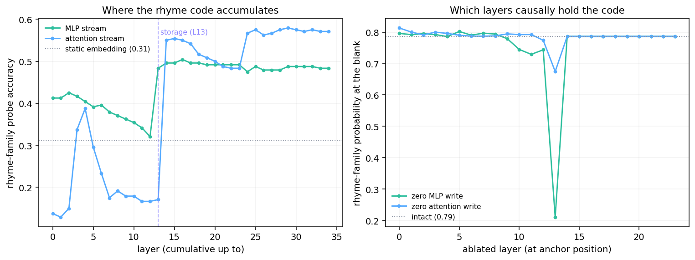

# Where rhyme is written: MLPs compute it, attention moves it

Phase 2 showed that a word's rhyme family is linearly decodable from the
layer-13 residual at the anchor, and Phase 3 showed that the layer-14 memory
built from it is what the retrieval head L24H3 reads. This report asks the
next question: **is rhyme a property of the word's representation, and which
part of the network writes it?**

The short answer: rhyme is not a static geometric property of a word — it is a
*contextual code*, and in the layers that feed the retrieval head it is carried
and causally written by the **MLP** sublayers, not by attention. Attention's
role comes later, as movement.

All results use `google/gemma-4-E2B` with eager attention, NF4. Rhyme families
are CMUdict exact rimes from the final stressed vowel. Probe accuracies are
5-fold cross-validated linear (logistic) probes over 240 single-token words in
30 families (chance = 0.033); their *absolute* level depends on the probe and
the number of classes, so every claim below rests on a **contrast** measured
with one fixed pipeline, not on an absolute number.

## Main conclusions

- **Rhyme is not readable from the raw residual or the embedding.** There,
  nearest-neighbour by cosine lands on a rhyming word only ~1 in 6 times and
  clustering recovers little (purity 0.23–0.32); a family probe on the layer-13
  residual reaches only ~0.30 on held-out words. The raw stream is dominated by
  other content.
- **But it is strongly readable where the head reads it.** The retrieval head
  does not consume the raw residual; it reads the layer-14 shared-attention
  *value* memory, which is the value projection of that residual. A probe there
  labels the rhyme family of **held-out words at 0.88** (30 classes, chance
  0.03) and **0.86 across a held-out scaffold**; even unsupervised clustering
  reaches 0.60 purity, and nearest-neighbour becomes a working rhyming
  dictionary. Probing the representation the circuit analysis identifies gives a
  strong, precise readout — the earlier weak numbers came from probing upstream.
- **It is contextual.** The layer-13 rhyme code is weaker for a word dropped in
  a neutral sentence than for the same word in a rhyming context, and every
  reading is far above its shuffled-label control. Behaviourally the whole
  mechanism only fires when the context calls for a rhyme.
- **The MLP stream carries it through the write region.** Decomposing the
  layer-13 representation into the cumulative attention update and the
  cumulative MLP update, the MLP stream is far more rhyme-decodable (0.48 vs
  0.17 at layer 13), and is already dominant by layer 2. Attention only becomes
  rhyme-decodable *after* layer 20 — after storage, when the head is moving it.
- **A single sublayer is causal: the layer-13 MLP.** Zeroing its update at the
  anchor collapses the final-token rhyme prediction (0.79 → 0.21, −73%); zeroing
  layer-13 attention barely touches it (−14%), and zeroing the MLP at any *other*
  single layer leaves it near baseline. The write is localized to one layer.
- **Synthesis: the MLPs compute what a word sounds like; the L24H3 attention
  head moves that code to where the next word is chosen.**

## 1. Rhyme is not in the raw residual geometry

A tempting hypothesis is that rhyming words sit near each other in the model's
residual stream. In the raw stream they do not, in any directly measurable way.
Taking rhyming words and asking each for its nearest neighbour by cosine
similarity in the layer-13 residual, only about **1 in 6** neighbours is a true
rhyme; clustering the raw residual reaches a purity of just **0.23–0.32**, and a
family probe on it recovers held-out words at only **0.30**. Static token
embeddings carry a little rhyme information (a probe reaches ~0.31, mostly via
spelling), but not enough to read rhyme off distances. In the raw stream, rhyme
is a low-variance *learned direction*, not the dominant geometry — which is why
§6 has to read it from the projected memory the head consumes, not from here.

## 2. Rhyme is computed in context

If rhyme were an intrinsic feature of a word, its layer-13 code would be as
readable in a plain sentence as in a poem. It is not. The same 240 words were
placed in three neutral scaffolds and three rhyming scaffolds; a probe was
trained on the layer-13 anchor state of each.

| Context | Scaffold | Probe accuracy | Shuffled control |
|---|---|---:|---:|
| neutral | "I heard the word …" | 0.121 | 0.042 |
| neutral | "The dictionary contained … the word …" | 0.150 | 0.037 |
| neutral | "She slowly spelled out the word …" | 0.138 | 0.029 |
| rhyming | "The final word upon the page was …" | 0.192 | 0.017 |
| rhyming | "Every line she wrote would end in …" | 0.225 | 0.021 |
| rhyming | "…a word that would rhyme, and chose …" | 0.175 | 0.046 |

Every reading is well above its shuffled-label control, so the code is always
partly present; but it is consistently stronger in a rhyming context (mean 0.20
vs 0.14). The representational effect is modest; the behavioural one is not —
the model only produces rhymes when the context asks for them. Rhyme is
computed on demand, not stored in the token.

## 3. The MLP stream carries the code, attention does not (until later)

In each Gemma block the residual receives two additive updates,
`post_attention_layernorm(attn(·))` and `post_feedforward_layernorm(mlp(·))`.
Summing each stream's updates from layer 0 up to layer L gives an exact
decomposition of the residual into "what attention has contributed" and "what
the MLPs have contributed," which we probe separately.

| up to layer | attention stream | MLP stream |
|---:|---:|---:|
| embedding (−1) | — | 0.312 |
| 2 | 0.150 | **0.425** |
| 5 | 0.296 | **0.392** |
| 9 | 0.179 | **0.363** |
| 13 (storage) | 0.171 | **0.483** |
| 20 | 0.500 | 0.492 |
| 27 | **0.567** | 0.479 |

Through the entire write region that feeds the retrieval head — layers 0 to 13 —
the MLP stream is far more rhyme-decodable than the attention stream, and the
MLPs have already injected most of the phonological structure by layer 2.
Attention's rhyme content only rises past layer 20, *after* the code is stored,
which is exactly where the L24H3 head reads and relocates it. The attention
stream carries rhyme late because that is the retrieval step, not the writing
step.

## 4. The layer-13 MLP write is causally necessary

Decodability is correlational. To test whether the MLP write *causes* the stored
code, we zero one stream's contribution at the **anchor position only**, in a
chosen band of layers, and measure the probability the model puts on the
anchor's rhyme family at the blank (25 natural rhyming couplets, baseline mass
0.786).

| Ablated at the anchor | Layers | Rhyme-family mass | Drop |
|---|---|---:|---:|
| nothing (baseline) | — | 0.786 | — |
| **MLP update** | **13 only** | **0.211** | **−73%** |
| attention update | 13 only | 0.674 | −14% |
| MLP update | 11–13 | 0.221 | −72% |
| attention update | 11–13 | 0.308 | −61% |
| MLP update | 0–13 | 0.226 | −71% |
| attention update | 0–13 | 0.210 | −73% |

The clean result is the single-layer contrast: **removing just the layer-13 MLP
write at the anchor destroys the rhyme code, while removing layer-13 attention
there leaves it almost intact.** The wide "attention 0–13" ablation also
collapses rhyme, but that is expected and not specific — deleting all attention
into the anchor across thirteen layers removes the model's ability to integrate
the line at all. The layer-resolved comparison is what isolates the MLP as the
writer.

## 5. Which layers hold the code

Repeating the anchor ablation one layer at a time localizes the write with
surprising sharpness.

| Single layer ablated at anchor | MLP update | attention update |
|---:|---:|---:|
| 10 | 0.745 | 0.792 |
| 11 | 0.729 | 0.792 |
| 12 | 0.744 | 0.774 |
| **13** | **0.211** | 0.674 |
| 14 | 0.786 | 0.786 |

(baseline 0.786; every layer outside this window is at baseline for both
streams.) Only **one sublayer in the whole network** is critical: the layer-13
MLP. Zeroing it at the anchor drops rhyme mass to 0.21; zeroing the MLP at any
other single layer barely moves it (layers 10–12 all stay ~0.73–0.75). No
single attention layer is critical — the most impactful, layer 13, only drops
mass to 0.67. Earlier MLPs contribute decodable phonological features (§3), but
the specific code the retrieval head consumes is consolidated and written by the
**layer-13 MLP**.



## 6. Reading rhyme sets off the code the head consumes

The right place to read rhyme is where the head reads it. Probing the layer-14
shared full-attention **value** memory at the anchor — the value projection of
the MLP-written residual, and the exact input to the L24H3 retrieval head — a
regularized linear probe labels the rhyme family of **held-out words at 0.88**
(30 classes, chance 0.03; the raw layer-13 residual, same probe and split, gets
0.30). Trained on one scaffold and tested on unseen words in another, it still
reaches **0.86**. The signal is phonemic and compositional: the same value
memory decodes the *coda* of an entirely held-out family at 0.82 (report 03).

Grouping held-out words by the readout's decision pulls out clean rhyme families
(`*` = the readout disagreed with CMUdict):

```text
AY1-T   : fight, site, might, despite, light, eight*, straight*
OW1-L-D : bold, cold, old, hold, told
IY1-T   : feet, heat, seat, meat, eat
EH1-N-T : percent, went, extent, consent, represent
EY1-M   : remain*, fame, name, flame, shame, game
IY1-N   : green, screen, queen, routine, clean
```

And a nearest-neighbour query in the value memory is a genuine rhyming
dictionary:

```text
light -> night, flight, right, fight, weight, might
grace -> space, trace, race, embrace, pace, place
rain  -> train, pain, brain, gain, chain, maintain
day   -> say, pay, may, today, way, stay
```

Unsupervised clustering of held-out words in this space reaches 0.60 purity,
against 0.32 for the raw residual. The contrast with §1 is the whole point: the
rhyme code the MLP writes is buried in the residual, but the layer-14 value
projection isolates it into a clean, near-linearly-separable family code — so a
correct identification of *where* the head reads yields a strong, precise
readout. Reproduce with `scripts/extract_rhyme_sets.py` (it consumes the value
memory captured by `run_gemma4_representation.py`).

## Interpretation

Together these give a concrete division of labour for the rhyme circuit:

```text
MLPs (peaking at layer 13)  ->  compute a word's phonology and write it into
                                the residual at the anchor
L24H3 attention head        ->  read that stored code and move it to the final
                                position, where the next word is chosen
```

This reframes the earlier steering and recombination results (reports 04–05):
those interventions add a direction at the *output of layer 13* — that is, they
edit the MLPs' product just before it is stored. They work because they are
writing to exactly the slot the MLP stream fills. It also explains why rhyme is
invisible to plain geometry: the code is a specific low-variance direction the
MLPs write when prompted, not a global arrangement of word vectors.

## Limits

- Probe accuracies are pipeline- and class-count-sensitive; only the contrasts
  (neutral vs rhyming, attention vs MLP, per-layer ablations) are claimed.
- The stream decomposition is correlational; §4–§5 supply the causal test, but
  the ablation is a bounded knockout at the anchor position, not a full account
  of every component.
- The context comparison shows a modest representational effect; the strong
  context dependence is behavioural.
- NF4, one base model, CMUdict single-token vocabulary. The MLP write has not
  been localized to specific neurons or features — only to sublayers and layers.

## Reproduction

```bash
PYTHONPATH=scripts .venv/bin/python scripts/run_gemma4_mlp_rhyme.py
PYTHONPATH=scripts .venv/bin/python scripts/run_gemma4_mlp_rhyme.py --only sweep
PYTHONPATH=scripts .venv/bin/python scripts/extract_rhyme_sets.py   # section 6
.venv/bin/python scripts/plot_gemma4_mlp_rhyme.py
```

Rows and a summary are written to `artifacts/gemma4_mlp_rhyme/`; the figure is
`results/figures/gemma4_mlp_rhyme.png`.
