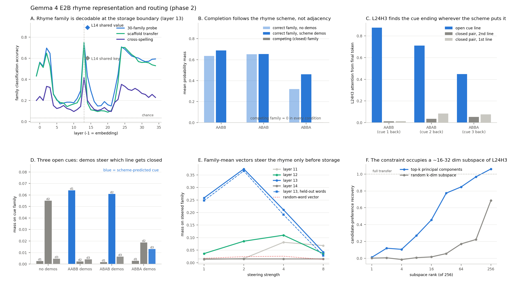
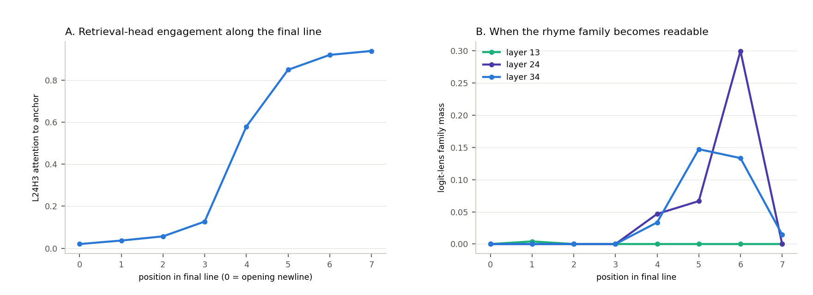

# What the rhyme circuit computes: representation, routing, and readout in Gemma 4 E2B

Phase 1 (`gemma4_rhyme_mechanism.md`) identified a storage-and-retrieval
circuit: layers 12–13 build an anchor representation, layer 14 stores it in the
shared full-attention value memory, and head L24H3 retrieves it at the final
token. Phase 2 asks what those components actually compute. All experiments use
the same base model (`google/gemma-4-E2B`, NF4) and CMUdict exact-rhyme
definitions.



## Executive summary

1. **The stored code is a phonological rhyme-family code, and the layer-14
   shared value is its cleanest carrier.** A linear probe reads 30-way rhyme
   family from the value memory at 89–91% accuracy — better than any residual
   layer — and transfers to *differently spelled* rimes at 57% (chance 4.5%).
   The shared key is far weaker (60% / 38%), matching phase 1's causal
   dissociation (value transfer 109%, key 0%).
2. **The family code is abstract and portable.** Adding a difference of family
   *means* — computed in a different context, from other words, even excluding
   each family's four most frequent members — at the anchor position redirects
   the completion: target-family mass rises from 1.5% to 37% and half the
   greedy completions switch family. Random vectors do nothing, and the same
   vector applied after storage (layer 14) does exactly nothing.
3. **L24H3 is an anchor pointer, not a rhyme-set enumerator.** Its direct
   output boosts the anchor token itself (+79.5 logits) and a phonetic
   neighborhood around it; only 23% of its top-20 direct readout is the rhyme
   family, and deleting only its direct path costs 2.6 points of rhyme mass
   (of the 65-point total). The rhyme *set* is constructed downstream, by
   layers 25–34, out of the retrieved anchor identity.
4. **Retrieval is scheme-aware, not positional.** The model completes AABB,
   ABAB, and ABBA quatrains with the scheme-correct family (never the closed
   competing family), and L24H3's attention finds the cue ending at distance
   1, 2, or 3. With three equally open cues, two demonstration stanzas
   reprogram which line the head addresses. The default policy with no
   demonstrations is "two lines back" — the common-meter quatrain convention.
5. **No line-start planning.** Unlike published results on Claude, this 2B
   base model shows no evidence of choosing the rhyme word early: the
   retrieval head engages progressively along the final line (2% → 94%
   attention) and the family becomes readable only at the last positions.
6. **The transferred constraint is ~16–32 dimensional** within the head's
   256-dimensional value channel (rank-32 patch recovers 77% of the effect;
   matched random subspaces recover 6%).
7. **The family code is compositional.** Probes for the coda transfer to
   entirely held-out families at 82% (vowel 45%; baselines ~17%): the value
   memory reuses phonemic parts across families rather than storing family
   identities.
8. **The scheme signal is split between query and memory.** Swapping the
   final-token state and the stanza's stored K/V between AABB- and ABAB-demo
   conditions each moves L24H3's target halfway; swapping both reproduces the
   other condition exactly.

A serious infrastructure bug was also found and fixed: the pinned Transformers
development revision silently ignores the attention mask on Gemma 4's sdpa
path, corrupting every left-padded batch row. All experiments now run with
eager attention (verified to match unbatched logits exactly), and every phase-1
headline number was re-derived under the fix (see final section).

## E1. Where the rhyme set lives

**Design.** 30 rhyme families (359 words, ≤12 words each, single-token,
frequency-filtered, final-syllable rimes only) were built from CMUdict and the
Gemma vocabulary (`src/rhyme_interp/families.py`). Each word was embedded in
two line-final scaffolds after the standard six demonstration lines (for
example `The final word upon the page was {word}`), and the residual stream at
the word's position was captured at every layer, together with the layer-13
sliding and layer-14 full-attention shared key/value memories.

**Family decodability tracks the causal storage boundary.** Cross-validated
30-way probe accuracy is 43% at the embedding, falls to ~17% through layers
5–11, spikes to **75% exactly at layer 13** — the causal boundary where
patching stops working in phase 1 — collapses back to ~15% at layers 15–21
after storage, and partially recovers late (71% at layer 24). Probes transfer
across scaffolds at essentially identical accuracy, so the code is
context-independent. Within/between-family cosine separation peaks at the same
layer (0.19).

**The shared value memory is the best and most abstract readout:**

| Representation | 30-way probe | cross-spelling (22-way) | within-spelling |
|---|---:|---:|---:|
| Embedding layer | 43.2% | 20.0% | 39.6% |
| Residual, layer 13 | 74.9% | 41.9% | 79.2% |
| Residual, layer 24 | 70.7% | 35.2% | 77.1% |
| **Layer-14 shared value** | **89.1%** | **57.1%** | **91.7%** |
| Layer-14 shared key | 60.2% | 38.1% | 52.1% |
| Layer-13 sliding K/V | 20–24% | — | — |

The cross-spelling test trains a probe on one rime spelling (`night, fight`)
and evaluates on others (`white, quite`); chance is 4.5%. The value memory
carries substantially spelling-invariant — that is, phonological — content,
far beyond the embedding baseline, though a residual orthographic component
remains (57% ≠ 92%). This extends phase 1's homophone evidence with a
360-word, 30-family test.

The layer-14 *key* is more decodable than its zero causal effect suggested:
family information is present in the key but evidently unused for addressing.
Decodability and causal use are different properties.

## E3. The code is portable: family-mean steering

**Design.** For 14 natural couplets whose anchors belong to lexicon families,
the vector `mean(target family) − mean(source family)` was computed from the
scaffold activations of E1 (a different context from the couplet prompts) and
added at the anchor position during the couplet forward pass.

| Intervention at layer 13, strength 2 | Target-family mass | Greedy in target family |
|---|---:|---:|
| Baseline | 1.5% | 0% |
| Full family means | **37.4%** | **50%** |
| Means excluding each family's 4 most frequent words | 36.6% | 50% |
| Random-word difference vector | 2.4% | 0% |

Source-family mass simultaneously falls from 73.1% to 7.5%. The effect is
layer-specific — layer 12 peaks at 11%, layer 11 at 8%, and **layer 14 stays
at exactly baseline for every strength** — reproducing the storage boundary
with a pure vector intervention. It is dose-sensitive (strength 8 overshoots
off-distribution and the effect collapses), as expected for an
in-distribution code.

The holdout variant matters: the vector still works after removing the very
words the model is most likely to produce, so what is being added is not "the
token embedding of `train`" but a family-level direction from which the model
itself reconstitutes the concrete candidates.

## E2. What the retrieval head writes

**Direct logit attribution.** Each layer-24 head's residual update was
projected through frozen norms onto the unembedding, restricted to the 50k
single-token-word vocabulary:

| Layer-24 head | family-minus-nonfamily contribution (logits) | top-20 in family |
|---|---:|---:|
| **H3** | **+29.3** | **22.8%** |
| H0 (next best) | +4.2 | 5.4% |

L24H3 is the only head whose direct output favors the rhyme family. But its
top-20 readout is not the rhyme set — it is the anchor and its sound-alikes
(`rain → iain, rain, bain, rains, wain, pain…`; `moon → moon, hoon, leon,
poon, boon…`), and the anchor token itself gets +79.5 logits, 2.5× the family
average. The head *copies a pointer to the anchor's phonological identity*
into the final position.

**The effect is almost entirely indirect.** Ablating the head while replaying
every later final-position update from the clean run (so only the direct path
to the logits changes) leaves rhyme mass at 76.0%, versus 78.6% clean and
13.4% under full ablation. Roughly 96% of the head's causal effect flows
through layers 25–34 — chiefly the late MLPs — which convert retrieved anchor
identity into the concrete rhyme-set preference. This explains phase 1's large
late-MLP ablation effects.

**Dimensionality.** Restricting the head-output transfer (phase 1's controlled
pairs) to the top-k principal components of the head's output distribution
over 359 anchors: k=16 recovers 46%, k=32 recovers 77%, k=64 recovers 85%
(random subspaces of the same rank: ≤6% until k≥64). The rhyme constraint is
not a single direction but a moderate-dimensional (~16–32 of 256) code —
consistent with it encoding *which family*, of many, is required.

## E4. Rhyme schemes: routing is structural, in-context, and generalizes

**Matched quatrains.** Each target stanza contains the same four lines under
all three schemes; the correct completion is always couplet B's family, and
only the position of B's open cue line changes. Demonstration stanzas (when
present) use disjoint families.

| Scheme (cue distance) | Correct-family mass, no demos | with demos | Competing mass | L24H3 attention to cue / adjacent-closed |
|---|---:|---:|---:|---|
| AABB (1) | 63.6% | 68.7% | 0.1% | 87.6% / 1.2% |
| ABAB (2) | 65.1% | 65.4% | 0.1% | 71.1% / 3.5% |
| ABBA (3) | 32.0% | 46.0% | 0.2% | 44.7% / 5.3% |

Greedy completions land in the correct family 84%/76%/68% (demos) and in the
competing family 0% everywhere. ABAB needs no demonstrations at all — the
model is not an adjacent-line rhymer, and L24H3 skips the adjacent closed
ending almost completely. Head ablation collapses the correct mass in every
scheme (for example ABAB 65% → 14%), so the same head carries the constraint
at every distance.

**Three open cues: the scheme is set in context.** A target stanza with three
mutually non-rhyming completed lines (all "open") plus a neutral incomplete
line was preceded by demonstrations in each scheme. Both behavior and the
head's attention follow the demonstrated scheme:

| Demo scheme | mass d1 / d2 / d3 | L24H3 attention d1 / d2 / d3 |
|---|---|---|
| none | 0.003 / **0.055** / 0.005 | 15.5% / **46.5%** / 8.3% |
| AABB | **0.064** / 0.002 / 0.004 | **59.6%** / 13.4% / 7.8% |
| ABAB | 0.002 / **0.061** / 0.007 | 13.0% / **52.3%** / 13.3% |
| ABBA | 0.003 / 0.019 / **0.013** | 25.0% / 28.2% / 14.9% |

Two demonstration stanzas re-aim a single attention head's addressing. The
no-demonstration default is distance 2 — the model's prior is the standard
ABAB quatrain, not couplet adjacency. ABBA remains genuinely hard (the
predicted cue never dominates, though it triples against baseline), matching
its rarity and the behavioral gap.

**External validity (Claude-generated data).** 33 fresh ABAB quatrains written
by Claude Haiku (novel vocabulary, CMUdict-validated exact rhymes,
`data/haiku_quatrains.jsonl`) behave the same with *no* demonstrations:
cue-family mass 73.0%, closed-family mass 0.2%, greedy rhymes with the cue in
88% of poems, and L24H3 puts 70.4% of its attention on the cue ending two
lines back (4.3% on the adjacent closed ending). The mechanism is not an
artifact of the hand-written benchmark.

Together these results refine the phase-1 story: the head's addressing policy
is best described as **"attend to the line ending that still needs a rhyme,
as defined by the stanza pattern in context"** — closed pairs are skipped at
every distance, and which open line wins is controlled by the demonstrated
scheme.

## E6. The stored code is compositional: vowel and coda are reusable parts

A rhyme family is a (stressed vowel, coda) pair. If families were stored as
unrelated identities, a probe for the vowel could not generalize to a family
it never saw. Leave-one-family-out probes (train on 29 families, test the
30th, only where the label also occurs elsewhere):

| Representation | vowel LOFO (10 classes) | coda LOFO (12 classes) |
|---|---:|---:|
| Embedding layer | 23.9% | 29.9% |
| Residual, layer 13 | 40.0% | 65.4% |
| **Layer-14 shared value** | **44.7%** | **81.7%** |
| Layer-14 shared key | 37.3% | 33.8% |

Majority-class baselines are ~17%. The value memory recognizes the coda of a
*never-seen* family at 82% — the code reuses phonemic components across
families rather than assigning arbitrary family IDs. Centroid RSA agrees:
same-coda families are much closer than different-coda families (cosine gap
+0.30 in the value memory; +0.07 at the embedding). The coda is more strongly
shared than the vowel, which is what exact-rhyme behavior needs: an exact
rhyme requires the full vowel+coda match, and codas are the discrete,
spelling-variable part (`-ight/-ite`, `-ind/-ined`).

## E7. The scheme signal lives in both the query and the memory — and in
nothing else

The open-cue AABB-demo and ABAB-demo prompts contain identical target stanzas
and equally long demonstration prefixes (the same eight lines, reordered), so
activations align position-for-position while the retrieved cue differs
(distance 1 versus 2). Swapping computation between conditions:

| Intervention on AABB-demo prompt | attn d1 / d2 | mass d1 / d2 |
|---|---|---|
| none (AABB behavior) | 0.596 / 0.134 | 0.064 / 0.002 |
| final-token residual into L24 from ABAB run | 0.396 / 0.243 | 0.011 / 0.014 |
| stanza-position shared K/V from ABAB run | 0.296 / 0.369 | 0.010 / 0.059 |
| **both** | **0.129 / 0.523** | 0.002 / 0.061 |
| (true ABAB behavior) | 0.130 / 0.523 | 0.002 / 0.061 |

The reverse direction is exactly symmetric. Each pathway alone moves the
head's target roughly halfway; the two together reproduce the donor condition
to three decimal places. So the demonstrations act twice: they change how the
stanza's line endings are *encoded into the shared memory* (which ending is
addressable — and this pathway carries most of the behavioral mass), and they
change the *final-token query* that addresses it. Routing is redundantly
distributed across exactly these two loci, and nothing else in the prompt
differs.

## E5. No evidence of line-start planning



At the newline that opens the incomplete final line, L24H3's attention to the
anchor is 2%, rising smoothly (13% three tokens in, 58% four tokens in) to
91% at the final position; logit-lens family mass at layer 34 is 1.3% at
non-final positions versus 17.4% at the final position. Gemma 4 E2B satisfies
the rhyme constraint by *incremental retrieval at emission time*, not by
selecting the target word when the line begins. The planning behavior reported
for Claude is therefore not a universal property of rhyming LMs; it either
emerges with scale/training or is genuinely absent here.

## Infrastructure finding: sdpa ignores the attention mask

While debugging an anomalous scheme result, we found that the pinned
Transformers development revision **silently drops the attention mask on
Gemma 4's sdpa path**: in a left-padded batch, padded rows attend to their EOS
padding and produce corrupted next-token distributions (for example `.` after
`Beyond the fields there passed a`), while eager attention reproduces
unbatched logits exactly. Short prompts with several padding tokens are
severely affected; long prompts are diluted but not clean.

All scripts now load the model with `attn_implementation="eager"`
(`src/rhyme_interp/model.py` documents the bug). The full phase-1 scan and
validation suite were re-run under the fix; every headline number replicates:

| Phase-1 quantity | Reported | Eager re-run |
|---|---:|---:|
| Clean rhyme mass / shuffled | 78.8% / 38.0% | 78.6% / 37.9% |
| L24H3 ablation mass / greedy rhyme | 13.7% / 24% | 13.4% / 24% |
| L24H3 anchor attention | 91.2% | 91.2% |
| Layer-13 single-layer patch recovery | +70.3 pts | +70.2 pts |
| Value-only / key-only KV transfer | 108.9% / −1.4% | 108.8% / −0.5% |
| L24H3 output transfer | 110.3% | 110.8% |
| Ordered→shuffled head transfer | 58.4% | 56.8% |

Phase 1's conclusions stand unchanged; its batches had little length variance.

## The refined mechanism in one sequence

```text
anchor token at a line ending
    ↓
layers 12–13 compute a largely spelling-invariant rhyme-family code
    (30-way linearly decodable; portable as a mean-difference vector;
     built from reusable vowel and coda components)
    ↓
layer 14 writes it into the shared full-attention VALUE memory
    (the network's cleanest phonological object; steering after this is inert)
    ↓
the stanza pattern in context is encoded twice: as addressability marks on
    the stored line endings AND in the final-token query state
    ↓
L24H3's final-token query addresses the scheme-appropriate open ending
    (re-aimable by two demonstration stanzas; default: two lines back)
    ↓
the head copies an anchor-identity pointer (~16–32 useful dimensions)
    into the final position — top direct readout: the anchor and sound-alikes
    ↓
layers 25–34 (mostly MLPs) expand the pointer into the rhyme SET
    (96% of the head's effect is indirect; the set is nowhere enumerated
     until these layers act)
    ↓
semantics selects a member of the set at the output
```

Where can the rhyme set be read out? Not from the head's output — from the
**layer-14 value memory via a linear probe** (89–91%), and behaviorally only
after the late MLPs. The "rhyme set" exists as a family *code* mid-network and
as explicit token preferences only at the end.

## BF16 replication

The three central phase-2 results were repeated in BF16 (activations
recaptured, vectors rebuilt, prompts rerun; `--bf16` on the representation,
steering, and scheme scripts):

| Quantity | NF4 | BF16 |
|---|---:|---:|
| L14 value 30-family probe | 89.1% | 87.2% |
| L14 value cross-spelling / within | 57.1% / 91.7% | 55.2% / 87.5% |
| L14 key 30-family probe | 60.2% | 50.7% |
| Layer-13 residual probe | 74.9% | 73.3% |
| Steering, layer 13, strength 2 (full / holdout) | 37.4% / 36.6% | 36.5% / 35.3% |
| Steering, layer 14 (any strength) | baseline | baseline |
| ABAB correct mass, no demos / with demos | 65.1% / 65.4% | 73.6% / 72.2% |
| ABBA correct mass, with demos | 46.0% | 60.8% |
| L24H3 cue attention AABB / ABAB / ABBA | 87.6 / 71.1 / 44.7% | 87.9 / 85.2 / 61.3% |
| L24H3 ablation, ABAB (demos) | 65% → 14% | 72% → 17% |

Everything replicates; scheme routing is, if anything, *stronger* at full
precision (NF4 slightly degrades the harder ABBA condition). None of the
phase-2 conclusions rest on quantization artifacts.

## Limitations

- The E2 head-output analyses (DLA, direct/indirect, rank), open-cue,
  scheme-signal, and planning experiments are NF4-only.
- 30 families × ≤12 words is small for probing standards; cross-spelling
  splits are unbalanced across families, and proper-noun-ish members survive
  the frequency filter in a few families.
- Steering covers 14 couplets and one target-family assignment; the open-cue
  absolute masses are small because the neutral final line exerts its own
  semantic pull.
- The rank analysis uses one scaffold family for its PCA basis.
- Logit-lens family mass is computed within the single-token-word vocabulary,
  and frozen-norm DLA linearizes two RMSNorms (softcapping ignored).
- The planning analysis is observational (attention + lens); a causal test
  (for example patching line-start states) has not been run.
- The "open line" addressing description is behavioral; we have not
  identified the upstream components that compute openness or the scheme
  prior.

## Reproduction

```bash
.venv/bin/python scripts/run_gemma4_representation.py   # E1 probes/geometry
.venv/bin/python scripts/run_gemma4_steering.py         # E3 steering
.venv/bin/python scripts/run_gemma4_head_output.py      # E2 DLA/paths/rank
.venv/bin/python scripts/run_gemma4_schemes.py          # E4 matched schemes
.venv/bin/python scripts/run_gemma4_open_cue.py         # E4 open-cue routing
.venv/bin/python scripts/run_gemma4_haiku_quatrains.py  # E4 external validity
.venv/bin/python scripts/run_gemma4_planning.py         # E5 planning lens
.venv/bin/python scripts/run_gemma4_phoneme_probe.py    # E6 compositionality
.venv/bin/python scripts/run_gemma4_scheme_signal.py    # E7 query vs memory
.venv/bin/python scripts/plot_gemma4_phase2.py          # figures
```

Raw outputs land in `artifacts/gemma4_{representation,steering,head_output,
schemes,planning}/`. Scripts must run with `PYTHONPATH=scripts` (they import
the phase-1 helpers).
